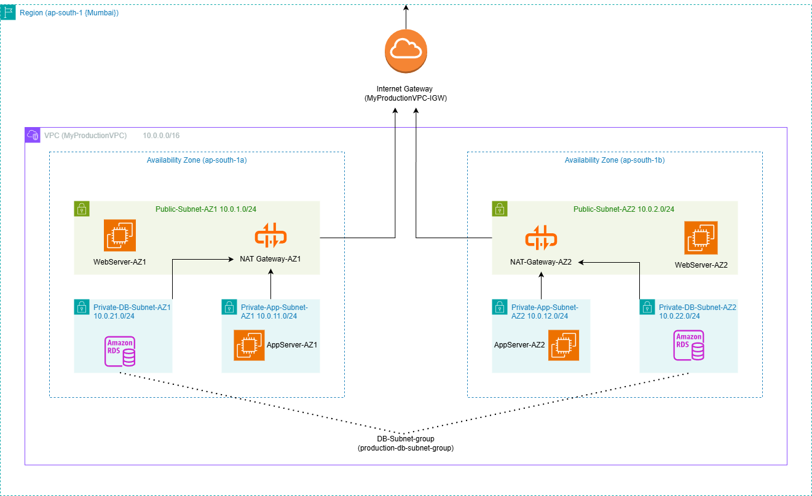

# AWS 3-Tier Web Application Architecture



## Project Overview

This project demonstrates a production-ready, highly available 3-tier web application architecture on AWS. The architecture is designed following AWS Well-Architected Framework principles, with emphasis on security, reliability, and cost optimization.

## Architecture Components

### VPC Configuration
- **CIDR Block**: 10.0.0.0/16
- **Region**: ap-south-1 (Mumbai)
- **Availability Zones**: 2 (ap-south-1a, ap-south-1b)

### Network Tiers

#### 1. Public Tier (Web Layer)
- **Subnets**: 
  - Public-Subnet-AZ1: 10.0.1.0/24
  - Public-Subnet-AZ2: 10.0.2.0/24
- **Components**: 
  - Web Servers (EC2 instances)
  - NAT Gateways (one per AZ)
  - Internet Gateway
- **Access**: Public internet access via Internet Gateway

#### 2. Private Application Tier
- **Subnets**:
  - Private-App-Subnet-AZ1: 10.0.11.0/24
  - Private-App-Subnet-AZ2: 10.0.12.0/24
- **Components**: Application Servers (EC2 instances)
- **Access**: Outbound internet via NAT Gateway, no inbound from internet

#### 3. Private Database Tier
- **Subnets**:
  - Private-DB-Subnet-AZ1: 10.0.21.0/24
  - Private-DB-Subnet-AZ2: 10.0.22.0/24
- **Components**: Amazon RDS MySQL
- **Access**: Only from Application Tier, no internet access

## Security Configuration

### Security Groups

| Security Group | Inbound Rules | Purpose |
|----------------|---------------|---------|
| **WebServer-SG** | HTTP (80) from 0.0.0.0/0<br>HTTPS (443) from 0.0.0.0/0<br>SSH (22) from My IP | Web server access |
| **AppServer-SG** | Port 8080 from WebServer-SG<br>SSH (22) from WebServer-SG | Application server access |
| **RDS-SG** | MySQL (3306) from AppServer-SG | Database access |

### Network Access Control
- Public subnets route internet traffic through Internet Gateway
- Private subnets route outbound traffic through NAT Gateway
- Database tier has no internet access (local routes only)

## Features

-  **High Availability**: Resources distributed across 2 Availability Zones
-  **Security**: Multi-layer security with Security Groups and private subnets
-  **Scalability**: Can easily add more instances in each tier
-  **Fault Tolerance**: Redundant NAT Gateways prevent single point of failure
-  **Cost Optimized**: Uses appropriate instance types and free tier eligible resources
-  **Best Practices**: Follows AWS Well-Architected Framework

## Traffic Flow

### Inbound User Request
```
Internet → IGW → Public Route Table → Web Server (Public Subnet) → App Server (Private Subnet) → RDS (DB Subnet)
```

### Outbound Traffic (Updates/API Calls)
```
App Server → Private Route Table → NAT Gateway → IGW → Internet
```

## Cost Estimation

Estimated monthly cost (ap-south-1 region):

| Component | Specs | Monthly Cost (USD) |
|-----------|-------|-------------------|
| EC2 Web Servers (2x t2.micro) | 1 vCPU, 1GB RAM | $0 (Free Tier) |
| EC2 App Servers (2x t2.micro) | 1 vCPU, 1GB RAM | $0 (Free Tier) |
| RDS MySQL (db.t3.micro) | 2 vCPU, 1GB RAM | $0 (Free Tier) |
| NAT Gateways (2x) | - | ~$65 |
| EBS Storage (100GB total) | gp3 | $0 (Free Tier) |
| Data Transfer | 1GB outbound | ~$0.10 |
| **Total (excluding free tier)** | | **~$65-70/month** |

**Note**: NAT Gateway is the primary cost. For learning, you can use a single NAT Gateway (~$32/month) or NAT Instance (cheaper but manual management).

## Setup Instructions

### Prerequisites
- AWS Account
- IAM user with administrative access
- Basic knowledge of AWS services
- AWS CLI configured (optional)

### Step-by-Step Deployment

#### 1. Create VPC
```bash
# VPC CIDR: 10.0.0.0/16
# Enable DNS hostnames and DNS resolution
```

#### 2. Create Subnets
- Create 6 subnets as per architecture (2 public, 2 private app, 2 private DB)
- Distribute across 2 Availability Zones

#### 3. Create Internet Gateway
- Attach to VPC

#### 4. Create NAT Gateways
- One in each public subnet
- Allocate Elastic IPs

#### 5. Configure Route Tables
- Public route table: 0.0.0.0/0 → IGW
- Private route tables: 0.0.0.0/0 → NAT Gateway

#### 6. Create Security Groups
- Configure as per security table above

#### 7. Create DB Subnet Group
- Include both DB subnets

#### 8. Launch RDS Instance
- Engine: MySQL 8.0
- Instance: db.t3.micro
- Multi-AZ: Optional
- Public access: No

#### 9. Launch EC2 Instances
- 2 Web servers in public subnets
- 2 App servers in private subnets
- Use appropriate user data scripts

### Detailed Setup Guide
See [docs/setup-guide.md](docs/setup-guide.md) for detailed step-by-step instructions.

## Testing

### Test Web Server Access
```bash
curl http://<WEB-SERVER-PUBLIC-IP>
```

### Test Database Connectivity
```bash
# From App Server
mysql -h <RDS-ENDPOINT> -P 3306 -u admin -p
```

### Test NAT Gateway
```bash
# From App Server
ping google.com
```

## What I Learned

- VPC design and subnet planning
- Multi-AZ architecture for high availability
- Security group layering and least privilege principle
- NAT Gateway vs NAT Instance trade-offs
- RDS subnet groups and Multi-AZ deployments
- Route table configuration and traffic routing
- AWS networking best practices

## Troubleshooting

See [docs/troubleshooting.md](docs/troubleshooting.md) for common issues and solutions.

## Resources

- [AWS VPC Documentation](https://docs.aws.amazon.com/vpc/)
- [AWS Well-Architected Framework](https://aws.amazon.com/architecture/well-architected/)
- [AWS Reference Architectures](https://aws.amazon.com/architecture/)

## 🤝 Contributing

Contributions, issues, and feature requests are welcome! Feel free to check the issues page.

## License

This project is [MIT](LICENSE) licensed.

## Author

**Pranav Soni**
- GitHub: [@pranavsoni21](https://github.com/pranavsoni21)
- LinkedIn: [Pranav Soni](https://linkedin.com/in/soni-pranav)
- Email: pranavsoni181@gmail.com

## ⭐ Show Your Support

Give a ⭐️ if this project helped you learn AWS networking!

---

**Built with ☁️ on AWS**